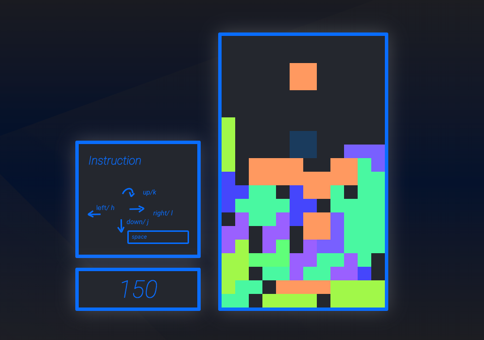

# TetrisV

A tetris game for vim beginner to learn direction movement, using `hjkl` to move tetrimino instead of arrow keys.

This game is build with `html5`, `css3`, `javascript es6`.

[Give it a try](https://skyying.github.io/tetrisV/)

# Screenshot

# How to play ?

* `hjl` key to move `left`, `down`, `right`
* `k` or `arrow up` to rotate tetrimino
* `Space` to drop tetrimino to bottom
* Press `any key` to restart again after game over

# What I learned from this project

## Design
This is more like a spaceship style, neon like, with the contrast color compared to the background, so that uses can focus more on their tasks. though the tranditional seven tetrimino have their own color.

## html5 canvas
I learnd how html5 canvas works. You can draw weather reactange, ellipse, bezier curve, line, point anything you want by the canvas web-APIs, like `fillRect(x, y, width, height)`, `arc(x, y, radius, startAngle, endAngle, direction)` to draw circle, also, I learned how to `not` use set timeout to update the animation.

## CSS3
css3 flex box prooperty is a very handy way to arrange the layout. In this project, I use `flex-direction` to arrange layout, set `display: flex` to those divs, and let them grow like row or column base on needs.

### tools for writing faster css3

I use emmet-vim in this project, the cognitive load is pretty havey due to there are huge css properties need to be memorized, though most of them are barely abbreviations. Using emmet did save a huge time for typing, weather using it in building markup or css styling.

### scss

I still using css preprocessor to enhance the whole workflow.

## Logic

This puzzle took more time than i think to slove. First is how to control the tetrimino, then is the effciency of rotating those piece, drawing those pieces without recreating them, adding drop hint without break any existing features. even more, there are still things need to be consider.

## Build tools
I use `webpack` in this project.

## IDE / text editor
I use `vim` + `tmux` + `ranger`.

# Issues
As usual, please report on the issue tracker

# Roadmap
[] RWD
[] puase/resume
[] `zz` to end the game
